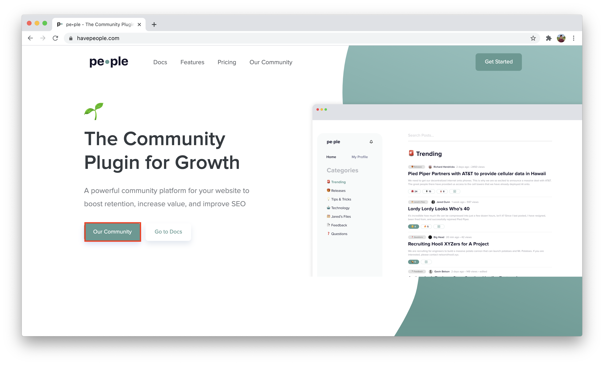

🛣 How users can navigate the community

## Using onclick (recommended)
The recommended approach is to add a button that calls the `toPeople()` method that comes with the setup
```html
<button onclick="toPeople()">Our Community</button>
```

For example, here's how it looks on our website


## Using href
you can also navigate to the `?people` extension with an `href` using an anchor
```html
<a href="?people">Our Community</a>
```
:::caution

This approach is not recommended as users would not be able to sign in with their **social accounts** (Google, Facebook, GitHub). This issue will be resolved soon.

:::