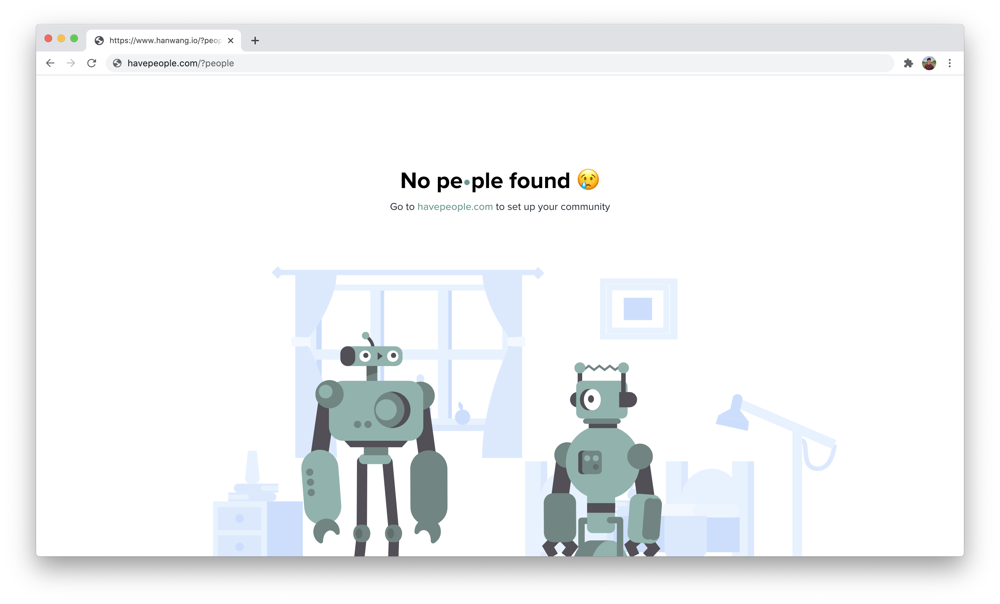

⏱ Get your community up and running in less than 30 seconds

## Installation
Add the following code snippet to the header of your website
```html
<!-- pe•ple community plugin -->
<script src="https://www.havepeople.com/connector.js"></script>
```

Navigate to your website with the `?people` extension in the URL like
```
yourdomain.com?people
```
You should see the following screen



:::info

Don't worry! This is to be expected and just means that your community hasn't been set up yet.

:::

## Complete the Setup
Email hello@havepeople.com or [sign up for early access](https://havepeople.com/#getaccess). A member of our team will get back to you shortly and help you get your community up and running!